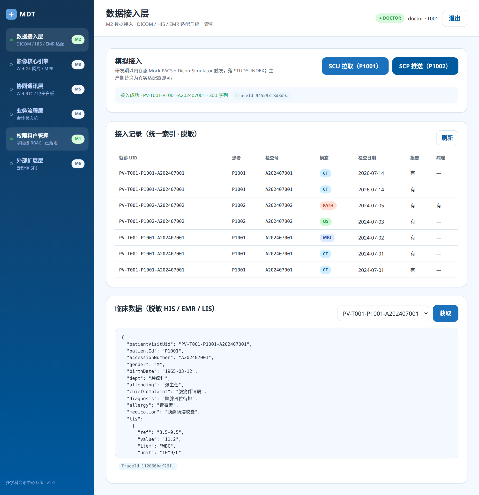

# M2 数据接入层 — 完成报告

## 1. 设计注记（≤200 字）

M2 采用「纯 Java 模拟适配层」落地数据接入：同进程内置 `MockPacs` + `DicomSimulator` 实现 SCU 拉取 / SCP 推送；通过 `IntegrationService` 完成 `PATIENT_VISIT` 幂等 upsert 与确定性 `PatientVisitUID`（`PV-{tenant}-{pid}-{acc}`）写入 `STUDY_INDEX`；临床数据经 `ClinicalDataAdapter` 聚合 HIS/EMR/LIS 后脱敏（无姓名、无身份证）。REST 入口注册在网关 `/api/integration/**`，前端新增「数据接入看板」页面。研发态以内存态运行，生产期替换为真实 DICOM 适配器与上游接口即可。

## 2. 接口定义

### 2.1 RESTful（网关对外）

| 方法 | 路径 | 说明 |
|---|---|---|
| POST | `/api/integration/simulate?mode=scu` | SCU 拉取模拟（P1001） |
| POST | `/api/integration/simulate?mode=scp` | SCP 推送模拟（P1002） |
| GET | `/api/integration/studies` | 统一索引接入记录列表（脱敏） |
| POST | `/api/integration/clinical` | 拉取某就诊的脱敏临床数据 |

请求/响应头均携带 `X-Mdt-TraceId`。

### 2.2 gRPC（域内）

定义于 `backend/mdt-integration/src/main/proto/integration.proto`：

- `rpc PullStudyFromPacs(PullStudyRequest) returns (PullStudyResponse)`
- `rpc IngestStudy(IngestStudyRequest) returns (Ack)`
- `rpc OnStudyReceived(StudyReceivedEvent) returns (Ack)`
- `rpc FetchClinicalData(ClinicalDataRequest) returns (ClinicalDataResponse)`

客户端通过 `ClientTraceInterceptor` 将 REST 线程 MDC 的 TraceId 写入 gRPC metadata `x-mdt-traceid`，实现「网关 REST → 域内 gRPC」全链路追踪。

## 3. 代码片段

### 3.1 显式声明 gRPC 客户端为 PLAINTEXT

研发期同进程内 gRPC 调用不使用 TLS，必须显式声明 `negotiationType: PLAINTEXT`：

```yaml
# backend/mdt-integration/src/main/resources/application.yml
grpc:
  server:
    port: 50055
  client:
    integration:
      address: localhost:50055
      negotiationType: PLAINTEXT
```

```java
// backend/mdt-integration/src/main/java/com/mdt/integration/rest/IntegrationController.java
@GrpcClient(value = "integration", interceptors = ClientTraceInterceptor.class)
private IntegrationServiceGrpc.IntegrationServiceBlockingStub integrationStub;
```

### 3.2 幂等统一索引与 TraceId 透传

```java
// 确定性 PatientVisitUID
public String resolveUid(String tenant, String pid, String acc) {
    return "PV-" + tenant + "-" + pid + "-" + acc;
}

// 幂等 upsert：先存在则覆盖，再写 STUDY_INDEX
public IngestResult ingest(IngestCommand cmd, String operatorId) {
    String uid = resolveUid(cmd.tenantId(), cmd.patientId(), cmd.accessionNumber());
    PatientVisit pv = pvRepo.findById(uid).orElse(new PatientVisit());
    pv.setPatientVisitUid(uid); ...
    pvRepo.save(pv);
    studyRepo.save(new StudyIndex(...));
    ...
}
```

### 3.3 临床数据脱敏聚合

```java
public String aggregate(String patientVisitUid) {
    Map<String, Object> m = new LinkedHashMap<>();
    m.put("patientVisitUid", patientVisitUid);
    m.put("patientId", pv.getPatientId());
    // 不输出姓名、身份证号
    m.put("gender", his.getGender());
    m.put("birthDate", his.getBirthDate());
    m.put("dept", his.getDept());
    m.put("diagnosis", emr.getDiagnosis());
    m.put("lis", lis.stream()...);
    return objectMapper.writeValueAsString(m);
}
```

## 4. 测试建议

1. **单元/集成测试**（已纳入 `mvn test`）：
   - `DicomAdapterTest`：验证 `DicomSimulator` 生成各模态数据集，`MockPacs` C-FIND/C-MOVE 返回已知患者。
   - `IntegrationGrpcTest`：SCU 拉取后 `STUDY_INDEX` 可查询；临床数据返回 JSON 不含患者姓名与身份证；`V_PATIENT_STUDIES` 视图可查询。
   - `Auth*` 测试保留 M1 的 JWT/异常/用户表覆盖。

2. **端到端自测**（本次已执行）：
   - 登录 `doctor/doctor123` → 前端 Vite 代理 → 网关 → 权限服务。
   - 进入「数据接入层」→ 点击「SCU 拉取（P1001）」→ 返回成功与 TraceId。
   - 查看「接入记录」列表 → 确认 `PV-T001-P1001-A202407001` 与 `PV-T001-P1002-A202407002` 的 CT/US/MRI/PATH 等记录。
   - 选择就诊 UID 点击「获取」→ 临床 JSON 包含 `patientId`、`gender`、`diagnosis`、`lis` 等，但**不含姓名、不含身份证**。
   - 检查浏览器响应头 `X-Mdt-TraceId` 与后端日志中的 TraceId 一致。

3. **生产前回归**：替换 `PureJavaDicomAdapter` 为真实 dcm4che3 / Orthanc 适配器；将 `grpc.client.integration` 地址改为内部 Kubernetes Service 并启用 TLS/mTLS；移除 `DataInitializer` 的 Mock 数据。

## 5. 部署说明

### 5.1 当前运行态（本次预览）

```bash
# 1. Postgres 15（已在 Docker 运行）
docker run -d --name mdt-postgres -p 5432:5432 -e POSTGRES_DB=mdt \
  -e POSTGRES_USER=mdt_app -e POSTGRES_PASSWORD=mdt_pass postgres:15

# 2. 启动权限服务（必须带 MDT_JWT_SECRET 环境变量）
export MDT_JWT_SECRET="<>=32 bytes"
nohup java -jar backend/mdt-auth/target/mdt-auth-1.0.0.jar > auth.log 2>&1 &

# 3. 启动数据接入服务
nohup java -jar backend/mdt-integration/target/mdt-integration-1.0.0.jar > integration.log 2>&1 &

# 4. 启动网关
nohup java -jar backend/mdt-gateway/target/mdt-gateway-1.0.0.jar > gateway.log 2>&1 &

# 5. 启动前端
nohup pnpm -C frontend dev > frontend.log 2>&1 &
```

### 5.2 关键配置

- 网关 `application.yml` 已将 `/api/integration/**` 路由到 `http://localhost:8082`。
- 集成服务 `application.yml` 中 `grpc.client.integration.negotiationType=PLAINTEXT` 仅用于研发/同进程调用；生产改为 TLS 或 `NegotiationType.TLS`。
- 数据库 `ddl-auto: update` 会在启动时自动建表；`SchemaInit` 创建 `V_PATIENT_STUDIES` / `V_CLINICAL_SUMMARY` 视图；`DataInitializer` 仅在研发态注入演示数据。

### 5.3 已知限制与后续切换点

- 当前 DICOM 为纯 Java 模拟层，未引入 dcm4che3，便于无影像设备的本地联调。
- 临床数据来自同库的 `MOCK_HIS_DEMO / MOCK_EMR_ENCOUNTER / MOCK_LIS_RESULT`，生产期需替换为院内 HIS/EMR/LIS 适配器。
- 网关到集成服务目前无 JWT 鉴权（集成服务仅内部暴露），后续由 M1 的 Gateway 安全过滤器统一收口。

## 6. 预览



截图展示：登录后进入「数据接入层」，执行 SCU 拉取，列表展示统一索引，临床数据面板返回已脱敏的 JSON 并携带 TraceId。
